# ServiceNow Help Desk Lab

Hands-on IT service management lab built on a ServiceNow Personal Developer Instance (PDI), modeled on my earlier [osTicket Help Desk Lab](https://github.com/MrBSykes). The goal is to practice the workflows a Tier 1 / Tier 2 service desk runs every day: role-based access, incident handling, SLAs, a knowledge base, and a CMDB.

**Release:** Australia (PDI) | **Author:** Bryan Sykes | **Status:** Phases 1-4 complete, Phase 5 next

---

## Lab scope and status

| Phase | Scope | Status |
|---|---|---|
| 1 | Users, groups, and role-based access (`itil`) | Complete |
| 2 | Incident categories and priority matrix (impact x urgency) | Complete |
| 3 | SLA definitions and testing against a P1 incident | Complete. All 8 definitions built; P1 tested end to end (attach, stop, pause, resolve). See [`docs/sla-plan.md`](docs/sla-plan.md) |
| 4 | Knowledge base with 5 articles from real troubleshooting | Complete. Knowledge base, 4 categories, and 5 published articles. See [`docs/kb-articles.md`](docs/kb-articles.md) |
| 5 | CMDB of the home lab with relationships and impact analysis | Planned. See [`docs/cmdb-plan.md`](docs/cmdb-plan.md) |

Phase 5 is designed but not yet built. I'll update this table and add screenshots when it is completed.

---

## Environment

- ServiceNow Personal Developer Instance, Australia release, free tier
- Phase 1 was first built in August 2026. That instance was reclaimed for inactivity, and the lab was rebuilt on a new Australia PDI in October 2026.
- Simulated team on one instance, using fictional personas so the ticket workflow reads like a real multi-person desk

| Persona | User ID | Role in the lab |
|---|---|---|
| Bryan Sykes | `bsykes.admin` | System administrator and group manager |
| Sam Okafor | `sam.okafor` | Tier 1 Support Agent (inherits `itil` through group membership) |
| Kate Olsen | `kate.olsen` | End user who submits tickets |

---

## Phase 1: Instance setup, users, and groups

### 1. Request and provision the instance

Requested a Personal Developer Instance from the ServiceNow Developer portal and waited for provisioning.

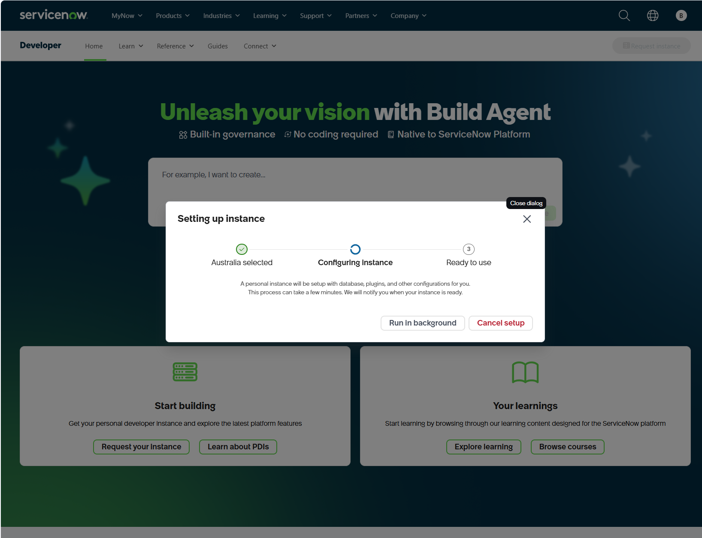

Instance online, with the Australia release, admin account, and 45 available plugins.

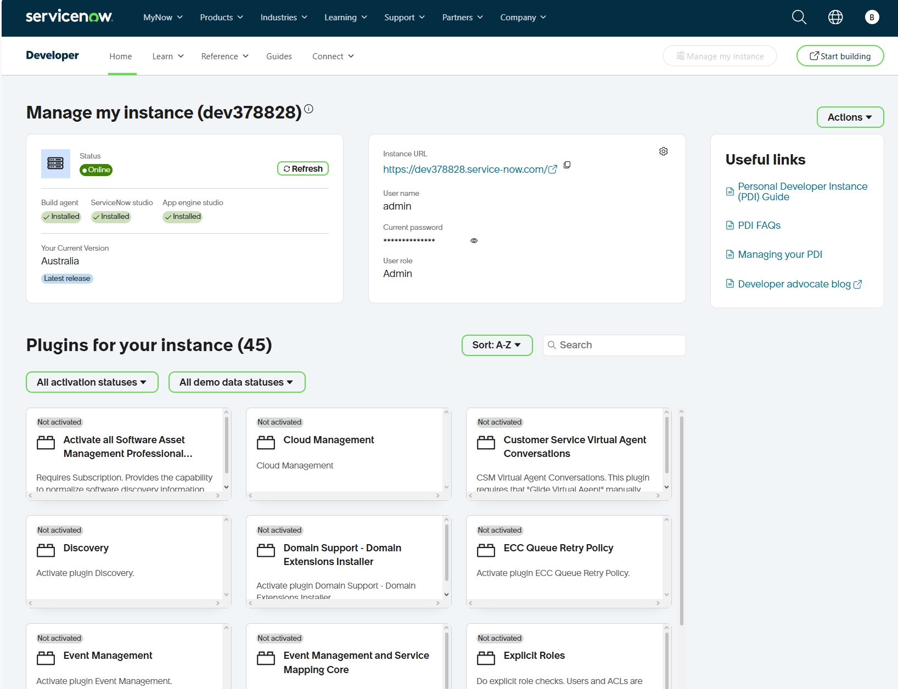

### 2. Create the Home Lab Help Desk group

Created the assignment group with a name and description. Entering `bsykes.admin` in the Manager field before that user existed failed with **Invalid reference**, because Manager is a reference to a User record and not a free-text field.

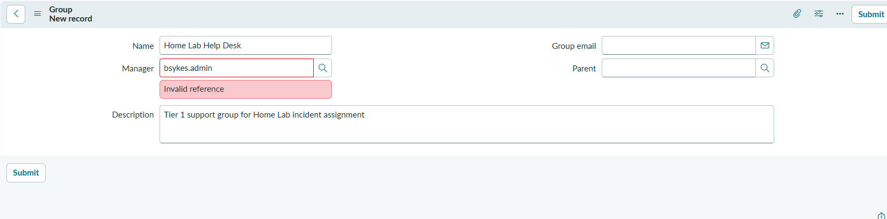

**Fix:** cleared Manager, saved the group, and created the users first. Manager was set afterward (step 5).

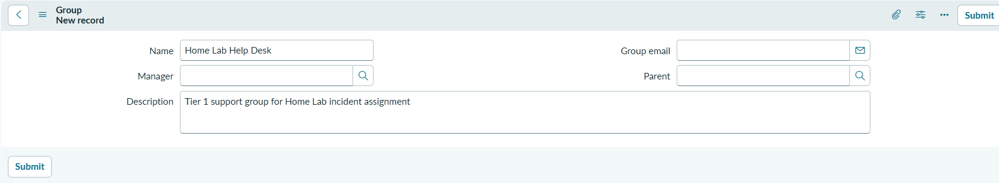

### 3. Find the Users table

The left navigator didn't surface **User Administration** on my instance. Rather than keep searching the menu, I opened the table directly by URL (`/sys_user_list.do`), which loads the Users list regardless of menu layout.

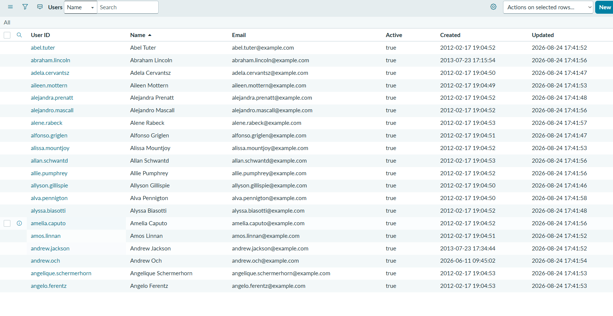

### 4. Create the three personas

Each user was created with User ID, first and last name, a `.local` placeholder email, and a title. Department and Manager were left blank.

**bsykes.admin** (system administrator)

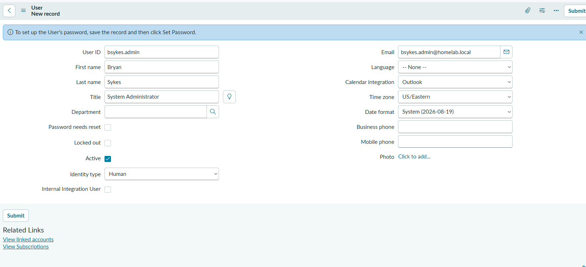

**sam.okafor** (Tier 1 Support Agent)

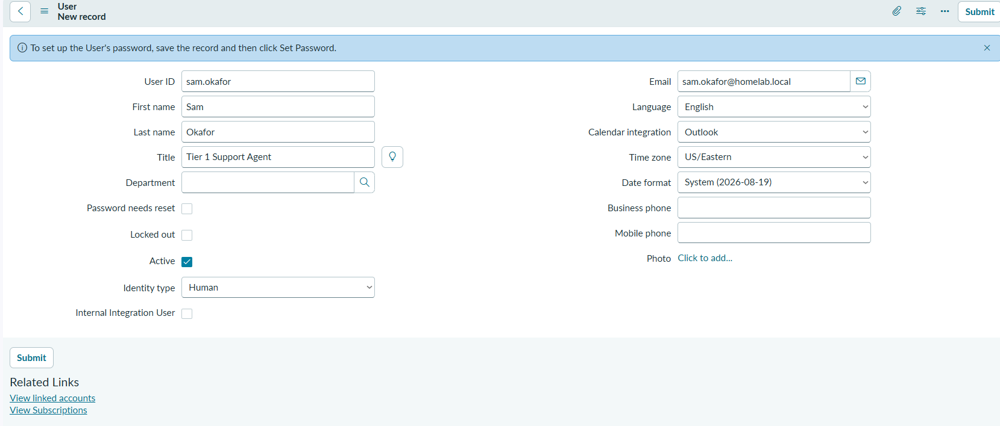

**kate.olsen** (end user)

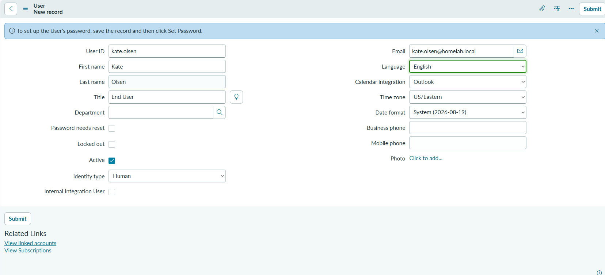

### 5. Set the manager and add the agent

With `bsykes.admin` now existing, Manager on the group resolved to **Bryan Sykes**, and **Sam Okafor** was added under Group Members.

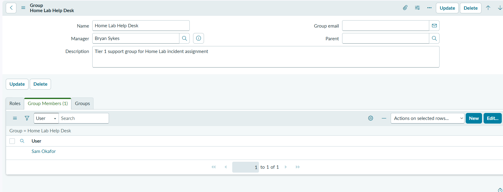

### 6. Grant the `itil` role at the group level

Attached the `itil` role to the group (Inherits = true) so every current and future member gets incident-handling access without per-user role assignments.

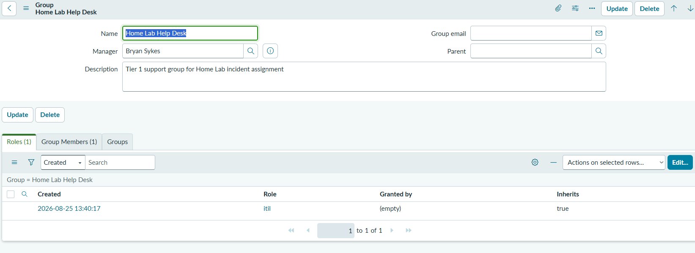

---

## Phase 2: Incident categories and priority matrix

### 1. Add home lab incident categories

The default incident Category choices (Hardware, Network, Software, and so on) didn't cover the services in my lab, so I added four custom choices alongside them instead of replacing anything. Each is a record in the Choices table (Table `incident`, Element `category`), and the Value field is required and does not auto-fill on this release.

| Label | Value | Sequence | Covers |
|---|---|---|---|
| Home Server | `home_server` | 200 | Docker and VM host issues |
| Network/DNS | `network_dns` | 210 | Pi-hole, router, connectivity |
| Penetration Testing | `pen_testing` | 220 | The Kali/Ubuntu test machine |
| Account Access | `account_access` | 230 | Logins, lockouts, resets |

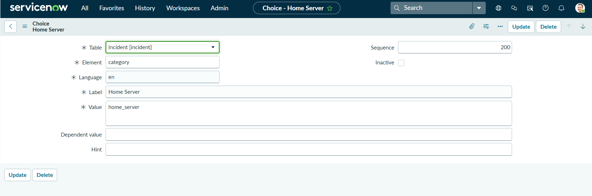
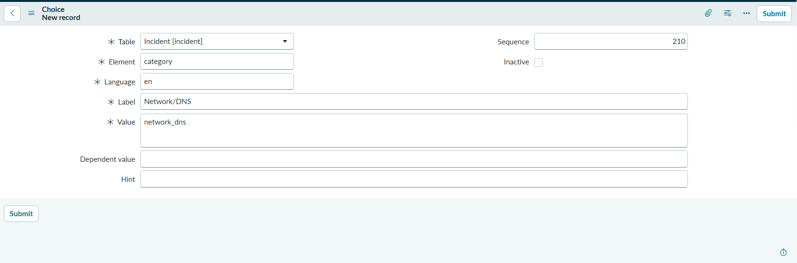
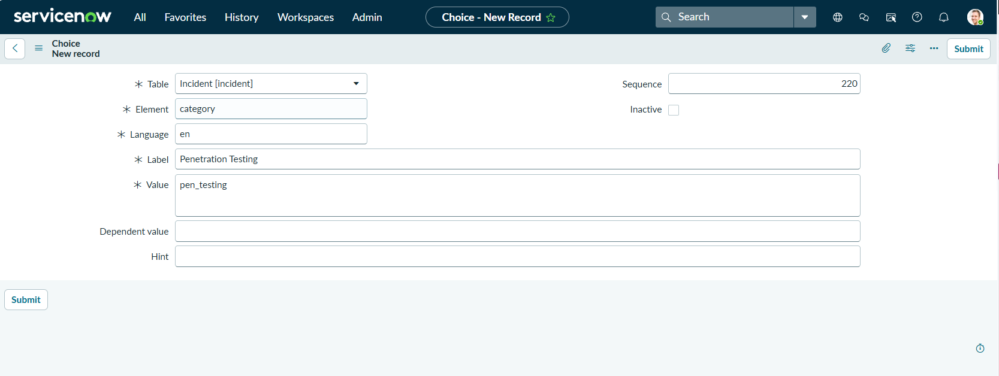
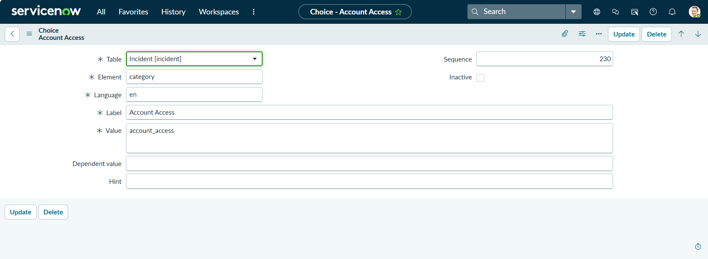

All incident category choices together, defaults and custom:

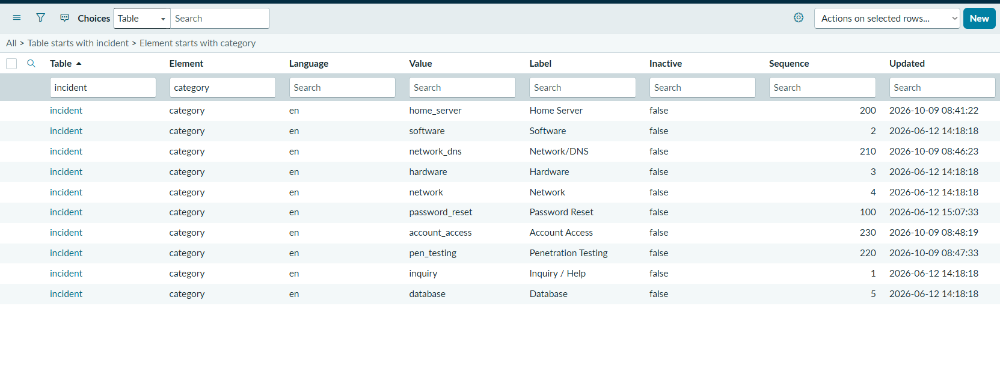

The new categories in the Category dropdown on a blank incident form:

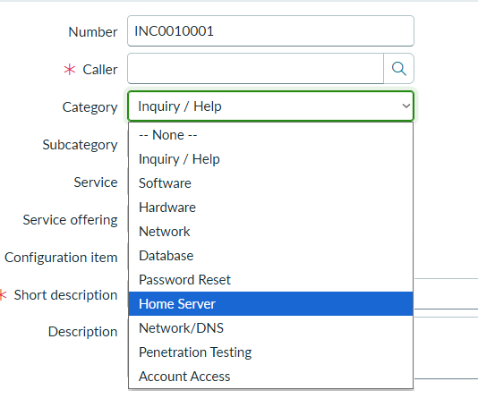

### 2. Verify the priority matrix

Priority is calculated from Impact and Urgency by the Priority Data Lookup rules. Rather than assume the defaults, I opened the rules table and checked them.

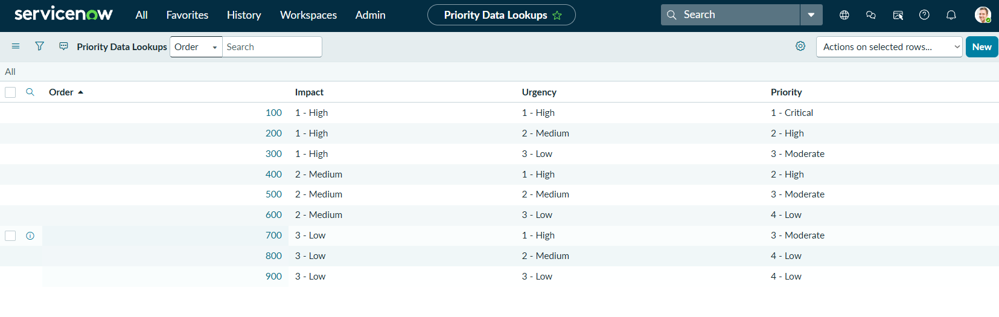

Testing it on a new incident form: Impact 1 - High and Urgency 1 - High resolves to Priority 1 - Critical automatically (the field is read-only).

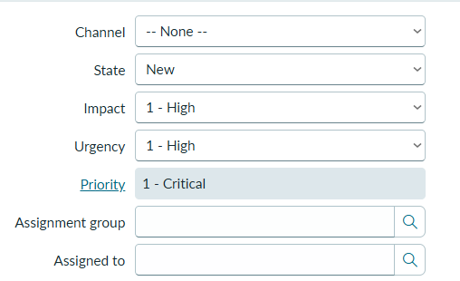

**Finding:** Impact 3 + Urgency 3 resolves to **4 - Low**, not 5 - Planning, so incidents on this release never reach Priority 5. The SLA plan covers priorities 1-4 and was corrected to match.

---

## Phase 3: SLA definitions and testing

### 1. Create a 24x7 schedule

SLA definitions require a schedule, and this release has no built-in 24x7 option, so I created one: a schedule named `24x7` with a single all-day entry that repeats daily, so the clock never pauses outside business hours.

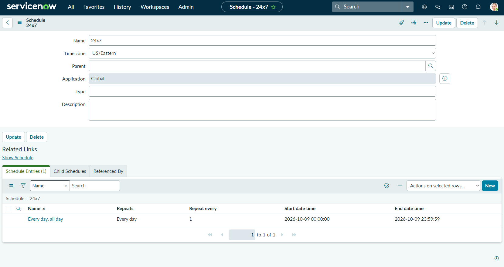

### 2. SLA definitions

Built a Response and a Resolution definition for each of priorities 1-4 (8 total), all on the incident table. Each starts when the incident's Priority matches. P1 and P2 use the 24x7 schedule; P3 and P4 use business hours. Pause and stop conditions follow [`docs/sla-plan.md`](docs/sla-plan.md).

P1 Response - 1 Hour:

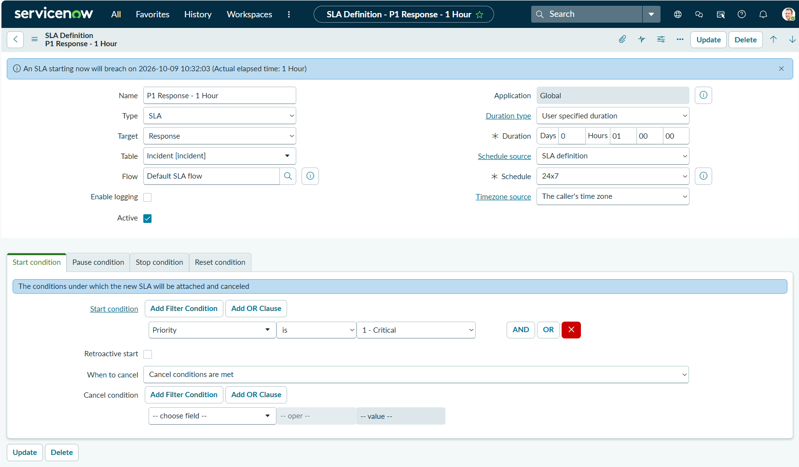

P1 Resolution - 4 Hours:

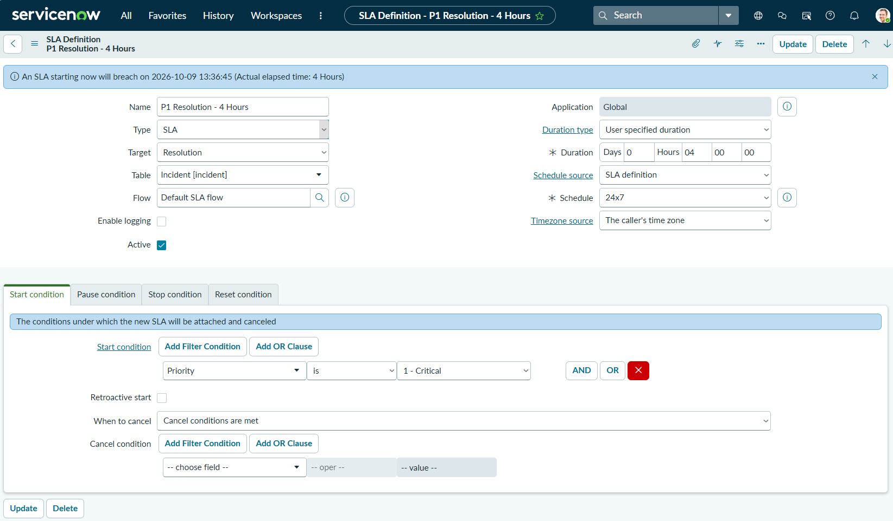

All eight definitions:

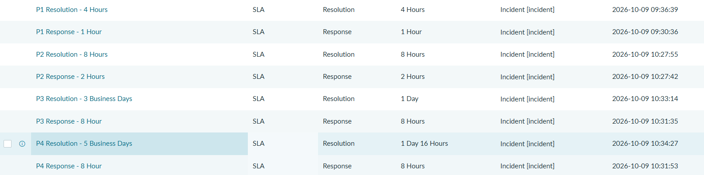

### 3. Test: a P1 incident from creation to resolution

To prove the SLAs work, I simulated the DNS outage from the knowledge base plan (see [`docs/kb-articles.md`](docs/kb-articles.md), KB0010001): caller Kate Olsen, category Network/DNS, short description "Network-wide DNS failure - Pi-hole unreachable", Impact 1 and Urgency 1, which resolves to Priority 1 - Critical.

**SLAs attach.** On save, three Task SLAs attached and started counting: my P1 Response and P1 Resolution definitions, plus a built-in "Priority 1 resolution (1 hour)" SLA that ships with the instance's demo data. (This capture is from the first test incident, INC0010002.)

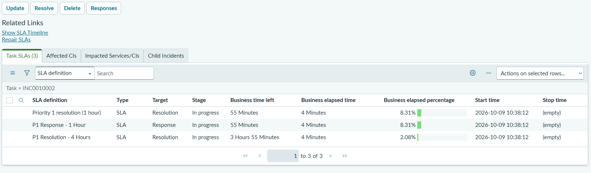

The next three captures are from the second, corrected run (INC0010006); see the troubleshooting log for why it was repeated.

**Assign to Tier 1.** Assigned to Sam Okafor. The Response SLA completed in 32 seconds, and the Resolution SLA kept running.

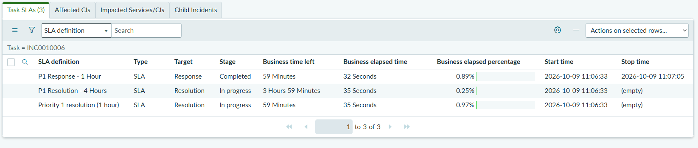

**Put it on hold.** Setting the state to On Hold paused the P1 Resolution SLA (stage Paused), which stops its clock while the ticket waits.

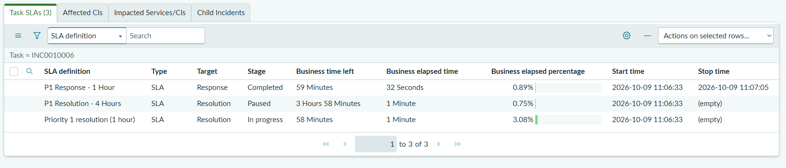

**Resolve.** Resolving the incident completed the P1 Resolution SLA with 1 minute of business time elapsed against a 4-hour target, so it did not breach.

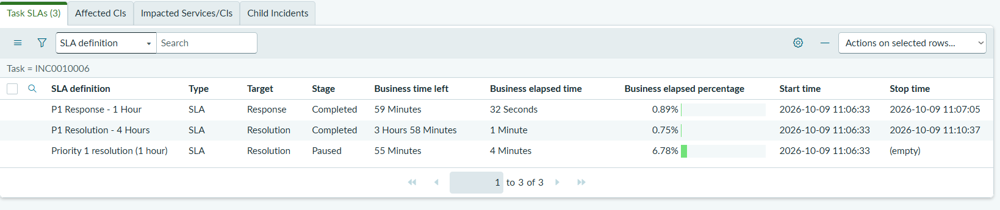

**Not covered yet:** only Priority 1 was tested end to end. P2-P4 definitions exist but were not exercised, and the 50/75/100% escalation notifications and a deliberate breach test from the SLA plan are not built.

---

## Phase 4: Knowledge base

### 1. Create the knowledge base

Created **Home Lab IT Knowledge Base** with Bryan Sykes as owner, Bryan Sykes and Sam Okafor as managers, and the Instant Publish flow so articles go live on save.

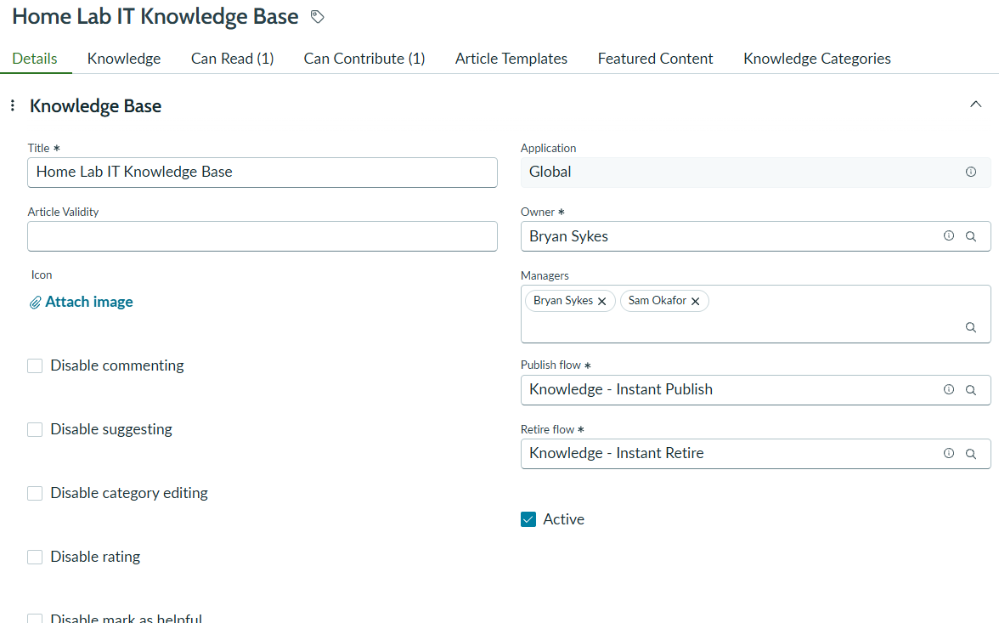

### 2. Add categories

Four categories, attached to the knowledge base: Network & DNS, Hardware, Operating Systems, and Security.

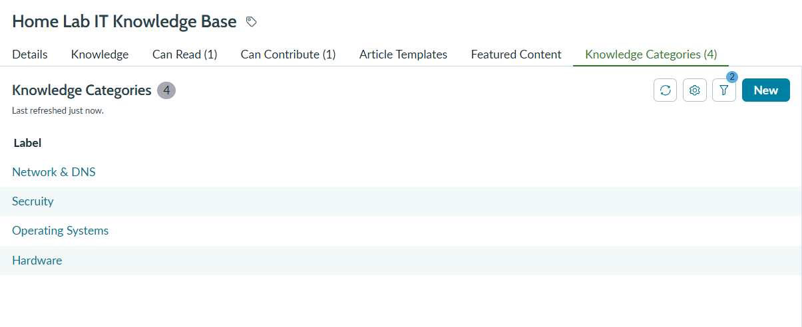

### 3. Publish five articles

The articles come from real problems I solved in my home lab, rewritten in a Symptoms, Cause, Resolution, Verification format so a Tier 1 agent can follow them. Drafts are in [`docs/kb-articles.md`](docs/kb-articles.md).

| Article | Title | Category |
|---|---|---|
| KB0010001 | Network-wide internet outage after a static IP change (Pi-hole DNS) | Network & DNS |
| KB0010002 | A website or deal link is blocked or breaks when using Pi-hole | Network & DNS |
| KB0010004 | Bootable USB won't create or won't boot in UEFI mode | Operating Systems |
| KB0010005 | Random blue screens (MEMORY_MANAGEMENT) after a BIOS update | Hardware |
| KB0010006 | Triage for a suspected ransomware infection and drive health check | Security |

The first article, published:

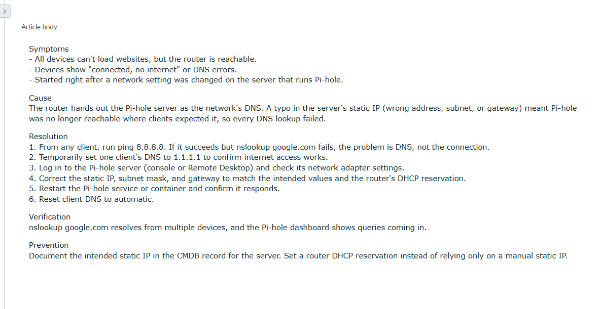

All five, Workflow = Published:

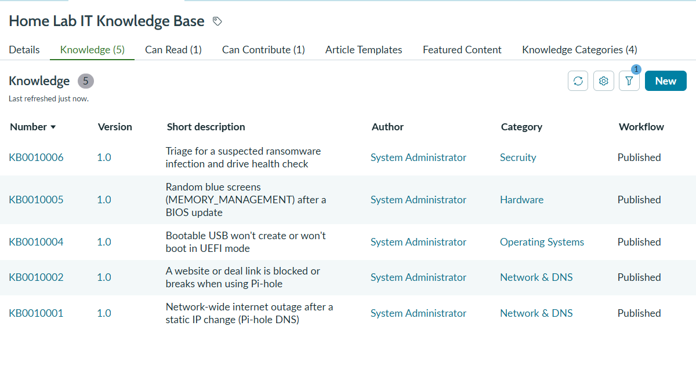

**Not covered yet:** linking an article to an incident and the CMDB references (the articles name the related CIs) come in Phase 5.

---

## Troubleshooting log

| Issue | Cause | Resolution |
|---|---|---|
| "Invalid reference" on the group Manager field | Manager is a User reference, and the user did not exist yet | Created users first, then set Manager |
| User Administration missing from the navigator | Menu layout and filtering differed on this instance | Opened the table directly with `/sys_user_list.do` |
| Instance not found after a long break | PDIs are reclaimed after a period of inactivity (confirmed by the notification email) | Requested a new instance and rebuilt Phase 1 from this documentation |
| New choice records wouldn't submit | Value is a required field and doesn't auto-fill from Label | Entered a lowercase, underscore-separated Value for each |
| Priority 5 never appeared in testing | The lookup rules on this release map Impact 3 + Urgency 3 to Priority 4 | Verified the rules table and updated the SLA plan to cover priorities 1-4 |
| No 24x7 option in the SLA Schedule field | This release has no built-in 24x7 schedule | Created a `24x7` schedule with an all-day daily entry |
| Stop condition field turned red when typing "not empty" | Conditions are built with the field/operator/value builder, not typed | Used the condition builder (Assigned to, is not empty) |
| P1 Resolution SLA completed as soon as the incident was assigned | Its stop condition fired at assignment instead of at resolution. Found by checking the Task SLA stage and stop time, not just the incident's activity log | Corrected the stop condition to State is Resolved and re-ran the test on a new incident |
| Create New on Knowledge showed only article templates | Newer releases open a template picker first | Chose the plain Blank template to get the standard article form |
| An extra SLA attached to the test incident | The instance ships with built-in demo SLA definitions, including "Priority 1 resolution (1 hour)" | Noted it in the test results; the lab's own definitions are the ones documented here |

## Lessons learned

- **Dependency order matters.** Reference fields need their target records to exist first, so users come before group managers and memberships.
- **PDIs are reclaimed when idle.** Treat the instance as disposable: export configuration as an **update set** and commit it to this repo so a rebuild takes minutes, not hours. Log in regularly while the project is active.
- **Assign roles to groups, not individuals.** Group-level role inheritance is easier to audit and scales as the team grows.
- **Verify results, not just configuration.** The first SLA test looked fine from the incident's activity log, but the Task SLA stop times showed the Resolution SLA had stopped early. Checking the evidence caught a wrong stop condition.
- **Verify defaults instead of assuming them.** The priority matrix differed from the documented defaults in one cell, and the SLA targets were adjusted to match what the instance actually does.

---

## Repository layout

```
.
├── README.md
├── docs/
│   ├── kb-articles.md
│   ├── sla-plan.md
│   └── cmdb-plan.md
└── screenshots/
```

## Skills demonstrated

ServiceNow administration (users, groups, roles, reference fields, choice lists, schedules), role-based access control, ITIL-aligned incident categorization and priority, SLA design, knowledge management, CMDB design, structured troubleshooting and documentation.
